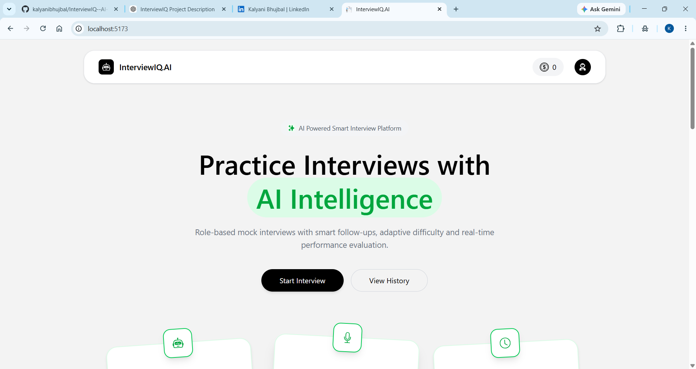
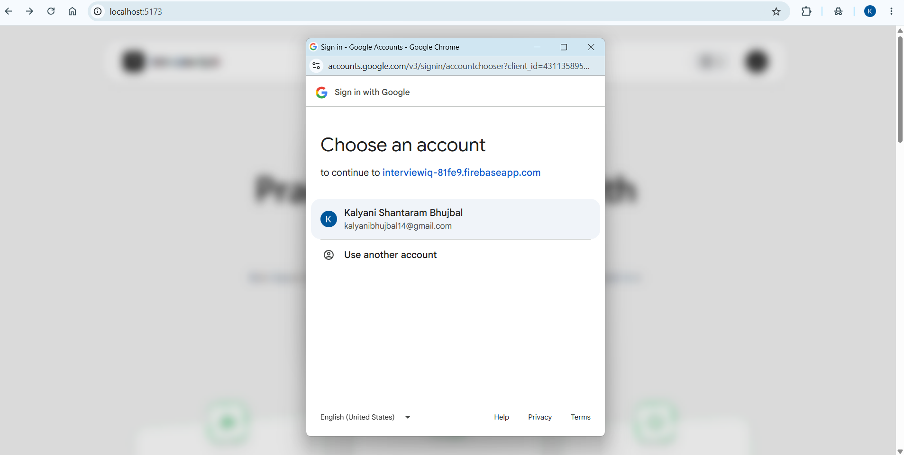
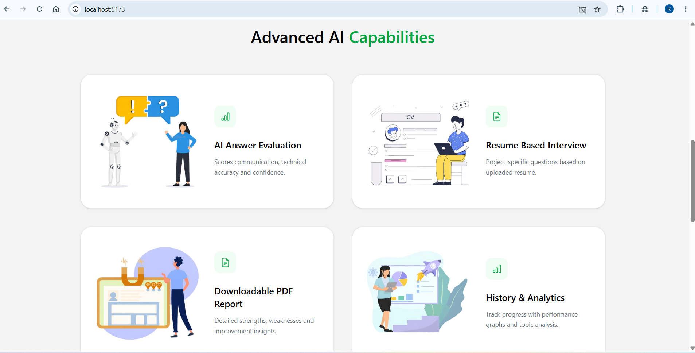
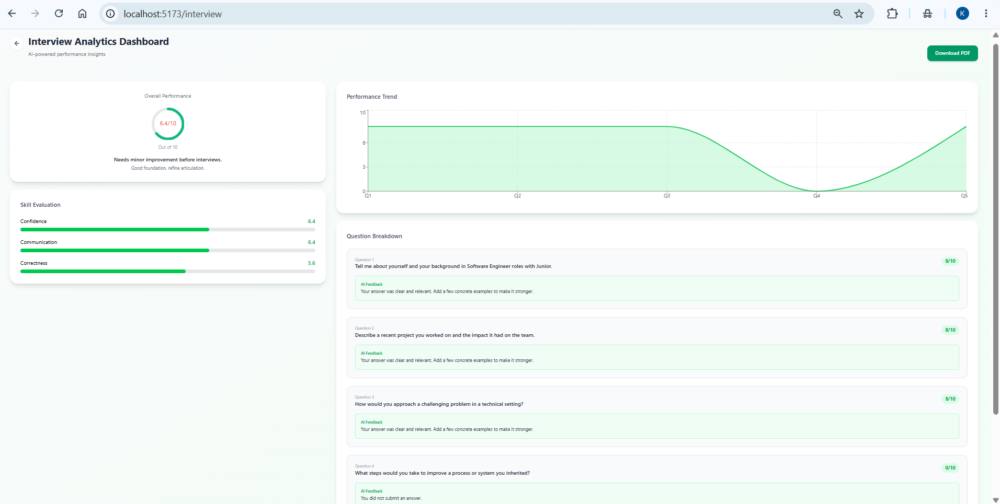
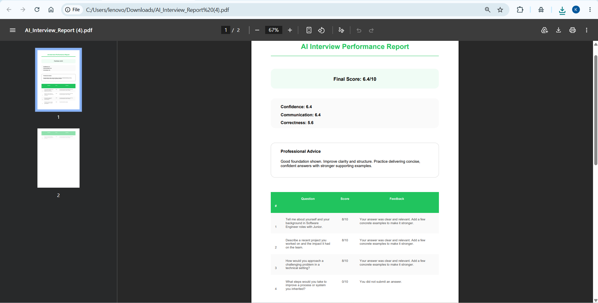

# 🎯 InterviewIQ – AI-Powered Mock Interview Platform

InterviewIQ is an AI-powered mock interview platform designed to help students, fresh graduates, and job seekers prepare for HR and technical interviews. The platform generates personalized interview questions, evaluates responses using AI, provides detailed feedback, and tracks user performance to improve interview skills and confidence.

---

## ✨ Features

* 🤖 AI-generated HR & Technical Interview Questions
* 📄 Resume-based Interview Generation
* 💬 Interactive Mock Interview Sessions
* 📝 AI-powered Answer Evaluation & Feedback
* 📊 Performance Dashboard & Interview History
* 📥 Downloadable PDF Interview Reports
* 🔐 Secure User Authentication with Firebase
* 💳 Premium Subscription Integration with Razorpay
* 📱 Responsive UI for Desktop & Mobile

---

## 🛠️ Tech Stack

### Frontend

* React.js
* HTML5
* CSS3
* JavaScript
* Tailwind CSS

### Backend

* Node.js
* Express.js

### Database

* MongoDB

### Authentication

* Firebase Authentication

### AI Integration

* OpenRouter API

### Payment Gateway

* Razorpay

---

## 📂 Project Structure

```text
InterviewIQ/
│
├── client/
│   ├── src/
│   ├── public/
│   ├── .env
│   └── package.json
│
├── server/
│   ├── controllers/
│   ├── models/
│   ├── routes/
│   ├── .env
│   └── package.json
│
└── README.md
```

---

## 🚀 Installation

### 1. Clone the Repository

```bash
git clone https://github.com/your-username/InterviewIQ.git
cd InterviewIQ
```

### 2. Install Dependencies

#### Client

```bash
cd client
npm install
```

#### Server

```bash
cd ../server
npm install
```

---

## ⚙️ Environment Variables

Create a `.env` file in both the **client** and **server** folders.

### 📁 Client (`client/.env`)

```env
VITE_FIREBASE_APIKEY=your_firebase_api_key
VITE_RAZORPAY_KEY_ID=your_razorpay_key_id
```

### 📁 Server (`server/.env`)

```env
PORT=8000
MONGODB_URL=your_mongodb_connection_string
JWT_SECRET=your_jwt_secret
OPENROUTER_API_KEY=your_openrouter_api_key
RAZORPAY_KEY_ID=your_razorpay_key_id
RAZORPAY_KEY_SECRET=your_razorpay_key_secret
```

> **Note:** Never upload your actual `.env` files to GitHub. Replace the placeholder values with your own credentials before running the project.

---

## ▶️ Running the Project

### Start the Backend

```bash
cd server
npm run dev
```

### Start the Frontend

```bash
cd client
npm run dev
```

The application will run at:

* **Frontend:** `http://localhost:5173`
* **Backend:** `http://localhost:8000`

---

## 📸 Screenshots

### Home Page


### Login


### Dashboard


### Mock Interview


### AI Feedback


### PDF Report


---

## 🔮 Future Enhancements

* 🎥 Video-based Mock Interviews
* 🎤 Voice Recognition & Speech Analysis
* 💼 Company-specific Interview Preparation
* 💻 Live Coding Interview Support
* 😊 Emotion & Facial Expression Analysis
* 🌐 Multi-language Support
* 📈 AI-powered Personalized Learning Roadmap

---


## 👩‍💻 Author

**Kalyani Shantaram Bhujbal**

* GitHub: https://github.com/kalyanibhujbal
* LinkedIn: https://www.linkedin.com/in/kalyani-bhujbal-104b51316/

---

⭐ If you found this project useful, please give it a **Star** on GitHub!
